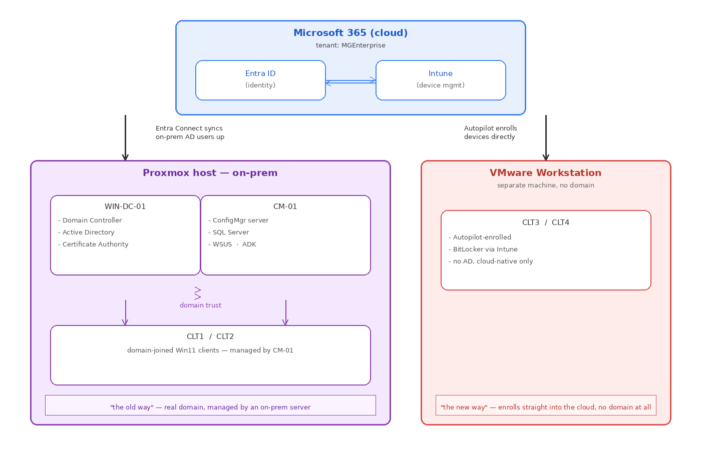

# My notes on this project (for interviews and my own sanity)

I'm writing this mostly for myself. When I built this lab I used a bunch of stuff I'd never touched before, so by the time an interviewer asks "so what's ConfigMgr actually do" I want a real answer instead of just "uh it manages computers." This doc is me explaining each piece to myself in plain language, plus a full list of everything that broke and how I fixed it, since that's usually what actually gets asked about in interviews anyway ("tell me about a time something didn't work").

If you're reading this and you're not me: sorry in advance, it's written like notes, not a polished writeup. The polished version is the main README.

---

## The big picture (topology)

Here's roughly how everything talks to everything. I drew this out for myself because I kept getting confused about what's "on-prem" and what's "cloud."

The short version: two client machines (CLT1/CLT2) live "the old way" — joined to a real domain, managed by an on-prem server. Two other machines (CLT3/CLT4) live "the new way" — no domain at all, enrolled straight into the cloud the moment they boot up. That split was on purpose, it let me show I understand both worlds, since most real companies are somewhere in between right now (that's literally what "co-management" is, more on that below).

---

## Part 1: The on-prem side — what each piece is and why

### Active Directory (AD) — WIN-DC-01

**What it actually is:** think of it as a giant phone book plus a bouncer. Every user account, every computer, every "who's allowed to do what" rule in an old-school Windows network lives here. The server that hosts it is called a **Domain Controller (DC)**.

**Why I needed it:** basically every other piece of this lab depends on it existing first. ConfigMgr needs a domain to publish itself into. Clients need to "join the domain" to be managed by it. Even the certificate authority needs AD to know who's allowed to request certificates.

**What "joining a domain" actually means:** normally a Windows PC is its own little island, it only knows about local user accounts you create on that one machine. When you join a domain, the PC starts trusting the Domain Controller's phone book instead, so now you can log in with an account that works across every machine in the company, and admins can push settings down to it centrally.

### Active Directory Certificate Services (AD CS)

**What it is:** a private "certificate factory." Normally when you visit a website with `https://`, your browser trusts a certificate that was issued by a public company like DigiCert. AD CS lets your own company issue its *own* trusted certificates for internal stuff, so internal websites/services can use HTTPS-style trust without paying a public certificate authority.

**Why I set it up:** a few features later in this build (and definitely if I'd built the Cloud Management Gateway) need certificate-based trust between the server and clients. Standing up a Certification Authority (I made it an **Enterprise Root CA** since I only have one CA and everything's in one domain) was prep work for that.

**Quick vocab I had to learn:** "Enterprise CA" means it's tied into Active Directory and can auto-issue certs to domain members without you clicking through a request form every time. A "Root CA" is the top of the trust chain, everything else trusts it because nothing trusts anything above it.

### Configuration Manager (ConfigMgr, formerly SCCM) — CM-01

**What it is:** the on-prem "control tower" for managing a fleet of Windows machines. Push software, push updates, enforce antivirus policy, image new computers, all of it, from one console, at scale, without walking to every desk.

**Why it's still relevant even with cloud tools like Intune existing:** a lot of companies have thousands of machines and years of process built around ConfigMgr. Ripping it all out for a pure-cloud setup overnight isn't realistic, so ConfigMgr sticks around, often working *alongside* Intune (see the co-management section below). Also, some things (like managing on-prem-only servers) genuinely need it.

ConfigMgr doesn't run alone though, it needs three other things installed first:

- **SQL Server** — ConfigMgr stores literally everything (every device record, every policy, every log entry) in a SQL database. No database, no ConfigMgr.
- **WSUS (Windows Server Update Services)** — this is what actually knows which Windows updates exist and can cache them locally so every PC in the building doesn't separately download the same patch from Microsoft. ConfigMgr hooks into WSUS to control which updates get approved and pushed out.
- **ADK (Windows Assessment and Deployment Kit)** — a toolkit needed for imaging/deploying new Windows installs (task sequences, WinPE boot images, that kind of thing). I installed it for completeness even though I didn't end up doing full OS deployment in this build.

### Domain-joined clients — CLT1 / CLT2

These are just regular Windows 11 VMs that joined `MGEnterprise.local` (the AD domain) and got the ConfigMgr client software installed on them. Once that client's installed and reporting in, CM-01 can see them, push policy to them, and manage them, that's the whole point of the on-prem management chain.

---

## Part 2: The cloud side — what each piece is and why

### Microsoft 365 tenant + Entra ID

**What "tenant" means:** it's your own dedicated slice of Microsoft's cloud. Nobody else's data touches yours. Mine is called `MGEnterprise`.

**What Entra ID is:** it's basically the cloud version of Active Directory. Same idea (user accounts, groups, sign-in), but instead of living on a server in a closet, it lives in Microsoft's cloud and works from anywhere, no VPN needed. It used to be called "Azure AD," Microsoft renamed it, so if you see both terms in older docs/videos, they mean the same thing.

### Intune

**What it is:** the cloud equivalent of ConfigMgr, it manages devices, but through the internet instead of an on-prem server, and it's built with modern stuff in mind (phones, remote workers, BYOD).

**Why both Intune AND ConfigMgr in one lab:** that's the whole "hybrid" point of this project. A lot of real companies are mid-transition from on-prem to cloud, not fully one or the other. Knowing how to work in that messy in-between state is more realistic than a lab that only shows the shiny end state.

### Entra Connect

**What it does:** this is the bridge. It's a piece of software you install on-prem (I put it on WIN-DC-01) that copies your on-prem AD accounts up into Entra ID, and keeps them in sync going forward. Change a password on-prem, it flows up to the cloud. This is what makes "hybrid identity" actually work, one account, works in both worlds.

**Why this matters for a real job:** almost every mid-size-or-bigger company doing any cloud migration has some version of this running. If you don't understand what Entra Connect does, you can't really troubleshoot "why isn't this user's cloud account working" tickets.

### Windows Autopilot — CLT3 / CLT4

**What it is:** a way to hand a brand-new (or freshly wiped) laptop to an employee, they turn it on, sign in with their work account, and the machine configures itself, joins the right groups, gets the right apps and policies, no IT person needs to touch it first.

**Why it's a big deal in real support jobs:** the old way was IT staging every machine by hand before shipping it out. Autopilot means you can literally dropship a laptop straight to someone's house and it sets itself up. This is standard now at a lot of companies, showing I understand the enrollment flow (hardware hash → device registered in Intune → deployment profile assigned → branded first-boot screen) is genuinely useful interview material.

**The "hardware hash" thing, explained:** every PC has a unique fingerprint based on its hardware (TPM chip, SMBIOS UUID, disk serial, etc.). You export that fingerprint once with a script (`Get-WindowsAutoPilotInfo`) and upload it to Intune, that's how Intune recognizes "oh, this specific machine belongs to us" the moment it boots up, before anyone's even logged in.

### BitLocker (via Intune)

**What it is:** full-disk encryption built into Windows. If a laptop with BitLocker on gets stolen, the thief can't just pull the hard drive and read the files off it, everything's scrambled without the key.

**Why manage it through Intune instead of just turning it on locally:** if you just enable BitLocker on a machine and something goes wrong (forgotten PIN, hardware change), you need the recovery key or that data's gone forever. Managing it through Intune means the recovery key automatically gets backed up to Entra ID, so IT can pull it up and unlock the machine remotely if someone gets locked out, instead of the key living only on a sticky note somewhere.

### Windows Defender Antivirus — managed on-prem via ConfigMgr

**What I did differently here:** instead of configuring antivirus through Intune (cloud), I did it through ConfigMgr (on-prem), on purpose.

**Why:** because a lot of real environments still manage AV on-prem, even ones that have moved everything else to the cloud. AV policy through ConfigMgr uses something called an "Antimalware Policy," basically a settings profile (real-time protection on/off, scan schedule, exclusions, etc.) that you deploy to a collection (a group of devices). I deployed mine only to a test collection containing CLT1, to prove the targeting actually works (only that one machine shows "managed by your administrator" in Windows Security, not every machine).

### Tenant Attach / Co-Management

This is genuinely the piece I'm proudest of understanding, because it's confusing at first.

**The problem it solves:** imagine a company has thousands of PCs managed by ConfigMgr for years. They want to move to Intune eventually, but can't just flip a switch overnight, that's way too risky. Co-management is the "in-between" state: **one device is managed by both tools at the same time**, and you decide, feature by feature, which tool is in charge of what.

**How I set it up:** I picked two specific things (Compliance Policies and Windows Update Policies) and told the system "hey, let Intune handle these two, ConfigMgr keeps handling everything else for this device." That's called moving a "workload" to Intune.

**The confusing number thing:** when you check a co-managed device, it shows a "capability" number like `8215`. That number isn't random, it's actually a bitmask (a single number where each bit represents a yes/no for a specific workload). I looked this up when I saw mine, `8215` decodes to "Compliance Policies + Resource Access Policies + Windows Update Policies are all managed by Intune." Knowing that this is a bitmask, not a version number or an error code, is a good "aha" moment to mention if it comes up.

---

## Part 3: What I deliberately did NOT build, and why

I want to be able to explain this clearly in an interview, because I think it's actually a strength, not a gap.

**Windows Defender Credential Guard** — this protects login credentials using virtualization-based security. I got partway into checking if my setup could even support it, and hit a wall (my VM couldn't see a hypervisor available to it, more on that in troubleshooting). While digging into the fix, I stepped back and realized: this is something a security/infrastructure team configures once, not something a helpdesk person touches day to day. I decided my time was better spent elsewhere.

**Cloud Management Gateway (CMG)** — this lets ConfigMgr manage devices over the internet without a VPN. I looked at what it actually takes to build one: a full certificate chain (server cert, client cert, group policy autoenrollment, trusted root certs), new boundary groups, a new site role, reconfiguring existing roles to accept the new traffic. That's realistically a full day of PKI-heavy work, and it's arguably even further from day-to-day helpdesk work than Credential Guard is. I chose to understand the architecture and explain it if asked, rather than spend a day building infrastructure work that isn't the job I'm applying for.

The reasoning I'd give in an interview: **scoping a project against what the role actually needs is itself a skill.** Building everything in a lab guide just because it's there isn't necessarily better than being deliberate about what's worth your time.

---

## Part 4: Everything that broke, and how I fixed it

This is the part I think actually matters most for interviews. Anyone can follow a set of steps that all work first try. Here's what didn't.

### 1. The MSOnline PowerShell module doesn't exist anymore

**What happened:** an early step needed me to look up an account name using a PowerShell module called MSOnline. `Install-Module MSOnline` kept failing no matter what I tried.

**What I checked first (before assuming it was my fault):**
- Confirmed my network could actually reach the PowerShell Gallery (DNS resolution and connectivity both worked fine)
- Tried fixing NuGet, updating PowerShellGet, forcing TLS 1.2

**The actual cause:** Microsoft fully retired the MSOnline module back in May 2025 and pulled it from the Gallery entirely. It was never coming back no matter what I fixed on my end, this wasn't a "me" problem, it was an "the tool doesn't exist anymore" problem.

**The fix:** I found the same information a different way, directly through the Entra Connect setup wizard's own "view current configuration" screen, no separate module needed.

**Lesson I'd repeat in an interview:** when something fails consistently no matter what you try, it's worth asking "does this tool still exist" before assuming you're doing something wrong.

### 2. Entra Connect sign-in kept failing with a vague error

**What happened:** during Entra Connect setup, I hit "There was an issue looking up your account" with no useful detail.

**How I worked through it, in order:**
1. Ruled out DNS/network first, directly tested resolution and connectivity to Microsoft's sign-in servers, both worked.
2. Found that Internet Explorer's Enhanced Security Configuration (a lockdown setting that's on by default on Windows Server) was blocking the wizard's embedded sign-in box from loading properly. Fixed that.
3. Still had issues, so applied a TLS 1.2 registry fix on the domain controller (older Windows Server setups sometimes don't default to TLS 1.2 for all connections, which modern Microsoft login pages require).

**Lesson:** don't just retry the same thing hoping it works, work through possible causes systematically and rule things out one at a time.

### 3. BitLocker said "100% encrypted" but wasn't actually protecting anything

This one's my favorite because it really tested whether I'd trust a number on a screen or actually dig in.

**What happened:** ran `manage-bde -status` on one client and saw Percentage Encrypted: 100%. Looked great. Except right below it: Protection Status: **Off**, and Key Protectors: **None Found**. Meaning: nothing was actually protecting that drive, despite the percentage saying 100%.

**What I checked first:** ran `Get-Tpm` to make sure the TPM chip (the hardware piece BitLocker needs) was actually working. It was, present, ready, enabled. So it wasn't a hardware problem.

**What actually caused it:** trying to manually add a TPM key protector kept throwing: `ERROR: BitLocker detected a bootable CD or DVD on the computer.` Even after I unchecked "connect at power on" for the virtual CD/DVD drive in my VM settings, same error.

**The real fix:** I had to fully **remove** the virtual CD/DVD device from the VM's hardware list entirely, not just disconnect it. BitLocker's TPM setup process apparently checks whether the *device itself* is present on the virtual controller, not just whether something's mounted in it.

**Lesson:** don't trust a summary percentage without checking what it actually means. "100% encrypted" and "actually protected" turned out to be two different things.

### 4. ConfigMgr console showed a client as unhealthy, but it wasn't

**What happened:** one client had a warning icon in the ConfigMgr console's device list.

**What I did instead of panicking:** went straight to the actual health check log on that client itself (`CcmEval.log`, under `C:\Windows\CCM\Logs`), instead of assuming the console icon was accurate.

**What I found:** every single health check in the log was showing PASSED. Client installed, client registered, communication with the management point, all green.

**Conclusion:** the console icon was just stale display data that hadn't refreshed yet, not a real problem.

**Lesson:** a management console's status icons are a summary, not the source of truth. When in doubt, check the actual log on the machine itself.

### 5. Client push kept failing until I fixed the boundary type

**What happened:** ConfigMgr wouldn't push its client software down to my domain-joined machines.

**The fix:** the boundary (the setting that tells ConfigMgr "these IP addresses belong to my network") was configured as an **IP Subnet**, and it was rejecting valid clients. Switching it to an **IP Range** instead fixed it.

**What I learned this actually means:** a "boundary" in ConfigMgr terms is just how the system figures out which site/location a device belongs to, so it applies the right settings. Getting that definition wrong (subnet math being stricter than expected) meant devices weren't being recognized as belonging anywhere.

### 6. The SQL Server install for ConfigMgr kept failing on a prerequisite

**What happened:** a piece called "SQL RMO" (Reporting/Replication Management Objects, part of what ConfigMgr needs to talk to SQL) failed to install.

**The fix:** had to manually install the Microsoft Visual C++ Redistributable first. The installer expected a version that wasn't present, once I got the right redistributable in place, the RMO piece installed cleanly.

### 7. ConfigMgr's Management Point wouldn't come up healthy

**The fix:** needed BITS (Background Intelligent Transfer Service, used for background downloads/uploads) installed, specifically including its **IIS Server Extension** sub-feature, which isn't obvious to know you need unless you've hit this exact wall before.

### 8. Autopilot hash export failed with an execution policy error

**What happened:** running the script to export a device's hardware hash failed with a message about script execution being disabled.

**The fix:** ran `Set-ExecutionPolicy -ExecutionPolicy RemoteSigned -Scope Process` first. This is a normal, expected thing on a totally fresh Windows install, PowerShell blocks running downloaded scripts by default until you explicitly allow it, at least for that session.

### 9. VMXNET3 network adapter had no driver during Autopilot setup

**What happened:** the Autopilot VMs (built on VMware, not Proxmox) got stuck at the very first network setup screen during OOBE (out-of-box experience).

**The fix:** the default virtual network adapter type (VMXNET3, which is actually a VMware-optimized driver type, not native Windows) doesn't have a built-in driver in stock Windows. Switching the VM's network adapter to **Intel E1000E** (an older, more universally-supported adapter type) fixed it immediately, Windows already ships with that driver built in.

### 10. Devices joined Entra ID but never actually enrolled into Intune

**What happened:** Autopilot devices would show up as Azure AD joined, but never actually became Intune-managed.

**The fix:** had to set **MDM user scope** to "All" in Entra ID (under Mobility settings) beforehand. Without this setting, a device can join the identity side (Entra ID) without ever being told to also enroll into the management side (Intune), they're technically two separate steps that this setting bridges.

### Documentation not matching the current portal (this came up constantly)

Worth its own note since it happened so many times: the lab guide I followed had several outdated references, download links that no longer exist, `endpoint.microsoft.com` (now `intune.microsoft.com`), old Azure AD portal navigation paths that have since moved in the current Entra portal, and policy profile types that have been replaced by newer versions (like BitLocker policies moving to the newer "Settings Catalog" format). None of this is really the guide's fault, Microsoft's admin portals genuinely change fast. But it meant I couldn't blindly trust every instruction, I had to verify what the current interface actually looked like before following any given step.

---

## Quick-reference glossary (stuff I had to look up more than once)

- **AD / Active Directory** — on-prem system that manages user accounts, computers, and permissions
- **DC / Domain Controller** — the server that hosts Active Directory
- **AD CS** — Active Directory Certificate Services, issues internal trusted certificates
- **ConfigMgr / SCCM** — on-prem tool for managing a fleet of Windows machines at scale
- **WSUS** — server that manages which Windows updates get approved and distributed
- **ADK** — toolkit needed for imaging/deploying Windows installs
- **Entra ID** — Microsoft's cloud identity system (formerly called Azure AD)
- **Intune** — Microsoft's cloud tool for managing devices
- **Entra Connect** — the bridge software that syncs on-prem AD accounts up to Entra ID
- **Hybrid Azure AD joined** — a device that's joined to both an on-prem domain AND registered in Entra ID at the same time
- **Autopilot** — Microsoft's zero-touch device provisioning system
- **Hardware hash** — a unique hardware fingerprint used to register a specific device with Autopilot
- **BitLocker** — Windows' built-in full-disk encryption
- **Co-management** — a device managed by both ConfigMgr and Intune at once, with specific features ("workloads") split between them
- **Workload** — a specific management feature (like Compliance Policy or Windows Update) that can be assigned to either ConfigMgr or Intune under co-management
- **Boundary** (ConfigMgr term) — defines which IP addresses/subnets belong to which site, so ConfigMgr knows where a device physically is
- **Collection** (ConfigMgr term) — a group of devices you can target policy at
- **TPM** — a small security chip that stores encryption keys, required for BitLocker
